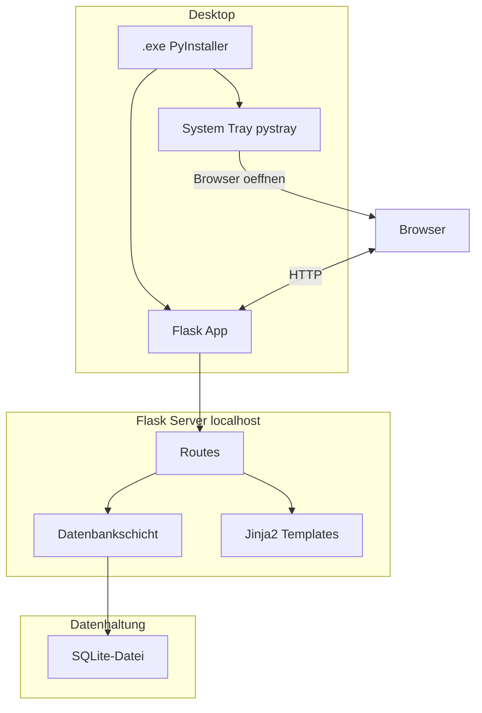

# Design-Dokument: Wartelisten-Kontaktverwaltung

## Übersicht

Die Wartelisten-Kontaktverwaltung ist eine lokale Desktop-Anwendung, die als leichtgewichtiger Flask-Webserver mit SQLite-Datenbank läuft. Die Bedienung erfolgt über den Browser. Die App wird als einzelne `.exe`-Datei via PyInstaller ausgeliefert und benötigt weder Installation noch Internetverbindung.

### Designprinzipien

- **Einfachheit**: Flache Architektur, minimale Abhängigkeiten, kein Over-Engineering
- **Datensicherheit**: Eingabevalidierung, SQL-Injection-Schutz via parametrisierte Queries, XSS-Schutz via Jinja2-Auto-Escaping
- **Plattformunabhängigkeit**: Python-Code ohne Windows-spezifische Abhängigkeiten (außer pystray-Konfiguration)
- **Offline-First**: Keine Netzwerkabhängigkeiten, alles lokal

## Architektur

### Architekturdiagramm



### Schichtenmodell

Die Anwendung folgt einem einfachen 3-Schichten-Modell:

1. **Präsentationsschicht**: Jinja2-Templates mit CSS/JS, serverseitig gerendert
2. **Anwendungsschicht**: Flask-Routes mit Geschäftslogik (Validierung, Sichtbarkeitsfrist-Berechnung)
3. **Datenschicht**: SQLite-Datenbank mit direktem `sqlite3`-Modul (kein ORM)

### Entscheidungsbegründungen

| Entscheidung | Begründung |
|---|---|
| `sqlite3` statt SQLAlchemy | Minimale Abhängigkeiten, SQLite ist einfach genug für direktes SQL |
| Jinja2 SSR statt SPA | Kein Build-Tooling nötig, einfacher, weniger Abhängigkeiten |
| Kein ORM | Nur eine Tabelle, direkte SQL-Queries sind übersichtlicher |
| JSON für Export/Import | Menschenlesbar, einfach zu verarbeiten, keine zusätzliche Bibliothek nötig |
| `pystray` für Tray | Leichtgewichtig, plattformübergreifend, gut gepflegt |

## Komponenten und Schnittstellen

### Projektstruktur

```
waitlist-contact-manager/
├── app.py              # Flask-App, Routes, Geschäftslogik
├── db.py               # Datenbankinitialisierung und -operationen
├── tray.py             # System-Tray-Integration (pystray)
├── main.py             # Einstiegspunkt: Server + Tray starten
├── validators.py       # Eingabevalidierung und Sanitisierung
├── templates/
│   ├── base.html       # Basis-Template mit Layout
│   ├── index.html      # Kontaktliste + Eingabemaske
│   └── import.html     # Import-Dialog
├── static/
│   ├── style.css       # Styling
│   └── script.js       # Minimales JS (Bestätigungsdialoge, Toggle)
├── icon.ico            # Tray-Icon
└── build.spec          # PyInstaller-Konfiguration
```

### Komponentenbeschreibung

#### `main.py` – Einstiegspunkt
- Startet den Flask-Server in einem separaten Thread
- Startet das pystray-Tray-Icon im Hauptthread
- Öffnet den Standard-Browser mit der App-URL
- Fährt den Server sauber herunter, wenn der Anwender "Beenden" wählt

#### `app.py` – Flask-Anwendung
- Konfiguriert die Flask-App (Secret Key, Template-Ordner)
- Definiert alle HTTP-Routes (siehe unten)
- Nutzt Jinja2-Auto-Escaping (standardmäßig aktiv)

#### `db.py` – Datenbankschicht
- `init_db()`: Erstellt die Datenbank und das Schema, falls nicht vorhanden
- `get_db()`: Gibt eine Datenbankverbindung zurück
- CRUD-Funktionen für Kontakte (alle mit parametrisierten Queries)
- Export/Import-Funktionen (JSON-Serialisierung/Deserialisierung)

#### `validators.py` – Eingabevalidierung
- `validate_contact(data)`: Validiert und bereinigt Kontaktdaten
- `validate_import_json(data)`: Validiert die Struktur einer Import-Datei
- Schutz gegen XSS durch Eingabebereinigung (zusätzlich zu Jinja2-Escaping)

#### `tray.py` – System-Tray
- Erstellt das Tray-Icon mit Menü ("Im Browser öffnen", "Beenden")
- Plattformunabhängige Abstraktion über pystray

### HTTP-Schnittstellen (Routes)

| Route | Methode | Beschreibung |
|---|---|---|
| `/` | GET | Kontaktliste anzeigen (mit optionalem `?show_hidden=1`) |
| `/add` | POST | Neuen Kontakt speichern |
| `/edit/<id>` | GET | Kontaktdaten zum Bearbeiten laden |
| `/edit/<id>` | POST | Bearbeiteten Kontakt speichern |
| `/delete/<id>` | POST | Kontakt löschen (nach Bestätigung im Frontend) |
| `/export` | GET | Alle Kontakte als JSON-Datei herunterladen |
| `/import` | GET | Import-Seite anzeigen |
| `/import` | POST | JSON-Datei importieren (mit Modus: ersetzen/zusammenführen) |


## Datenmodell

### SQLite-Schema

```sql
CREATE TABLE IF NOT EXISTS contacts (
    id INTEGER PRIMARY KEY AUTOINCREMENT,
    name TEXT NOT NULL,
    phone TEXT DEFAULT '',
    email TEXT DEFAULT '',
    notes TEXT DEFAULT '',
    created_at TEXT NOT NULL DEFAULT (datetime('now', 'localtime'))
);
```

### Feldbeschreibung

| Feld | Typ | Pflicht | Beschreibung |
|---|---|---|---|
| `id` | INTEGER | Auto | Eindeutiger Primärschlüssel |
| `name` | TEXT | Ja | Name des Kontakts (nicht leer) |
| `phone` | TEXT | Nein | Telefonnummer |
| `email` | TEXT | Nein | E-Mail-Adresse |
| `notes` | TEXT | Nein | Freitext-Notizen |
| `created_at` | TEXT | Auto | Erstellungsdatum im ISO-8601-Format |

### JSON-Export-Format

```json
{
  "version": 1,
  "exported_at": "2025-01-15T10:30:00",
  "contacts": [
    {
      "name": "Max Mustermann",
      "phone": "+49 123 456789",
      "email": "max@example.com",
      "notes": "Wartet auf Termin",
      "created_at": "2025-01-01T09:00:00"
    }
  ]
}
```

Das `version`-Feld ermöglicht zukünftige Schemaänderungen am Export-Format. Die `id` wird nicht exportiert – beim Import werden neue IDs vergeben.

### Sichtbarkeitslogik

Ein Kontakt ist **sichtbar**, wenn:
```python
(datetime.now() - contact.created_at).days <= VISIBILITY_DAYS  # Standard: 28
```

Die Sichtbarkeitsfrist (`VISIBILITY_DAYS`) wird als Konstante in `app.py` definiert (Standard: 28 Tage). Ausgeblendete Kontakte bleiben in der Datenbank und können über den Toggle "Ausgeblendete Kontakte anzeigen" eingeblendet werden.


## Korrektheitseigenschaften

*Eine Korrektheitseigenschaft ist ein Verhalten, das für alle gültigen Ausführungen eines Systems gelten muss – eine formale Aussage darüber, was die Software tun soll. Eigenschaften bilden die Brücke zwischen menschenlesbaren Spezifikationen und maschinell überprüfbaren Korrektheitsgarantien.*

### Property 1: Kontakt-Persistenz Round-Trip

*Für beliebige* gültige Kontaktdaten (Name nicht leer, optionale Felder beliebig leer oder gefüllt), soll das Speichern in die Datenbank und anschließende Lesen denselben Kontakt mit identischen Feldern und einem gültigen Erstellungsdatum zurückgeben.

**Validates: Requirements 1.2, 1.5, 5.3**

### Property 2: Whitespace-Namen werden abgelehnt

*Für beliebige* Strings, die ausschließlich aus Whitespace-Zeichen bestehen (einschließlich leerer String), soll die Validierung den Kontakt ablehnen und die Datenbank unverändert bleiben.

**Validates: Requirements 1.4**

### Property 3: Korrekte Wartedauer-Berechnung

*Für beliebige* Kontakte mit beliebigem Erstellungsdatum soll die berechnete Wartedauer exakt der Differenz in Tagen zwischen dem Erstellungsdatum und dem aktuellen Datum entsprechen.

**Validates: Requirements 2.2**

### Property 4: Sortierung nach Erstellungsdatum

*Für beliebige* Listen von Kontakten soll die Kontaktliste aufsteigend nach Erstellungsdatum sortiert sein – der älteste Kontakt zuerst.

**Validates: Requirements 2.3**

### Property 5: Sichtbarkeitsfilterung bewahrt Datenintegrität

*Für beliebige* Kontakte und beliebige Sichtbarkeitsfristen soll die Filterung genau die Kontakte zurückgeben, deren Erstellungsdatum innerhalb der Frist liegt, während alle Kontakte (sichtbar und ausgeblendet) in der Datenbank erhalten bleiben.

**Validates: Requirements 3.1, 3.2**

### Property 6: Update-Persistenz

*Für beliebige* existierende Kontakte und beliebige gültige neue Feldwerte soll das Aktualisieren eines Kontakts dazu führen, dass die Datenbank die neuen Werte enthält und das Erstellungsdatum unverändert bleibt.

**Validates: Requirements 4.2**

### Property 7: Löschung entfernt Kontakt vollständig

*Für beliebige* existierende Kontakte soll das Löschen dazu führen, dass der Kontakt nicht mehr in der Datenbank vorhanden ist und die Anzahl der Kontakte um eins sinkt.

**Validates: Requirements 4.4**

### Property 8: Export/Import Round-Trip

*Für beliebige* gültige Kontaktlisten soll das Exportieren als JSON und anschließende Importieren (im Ersetzen-Modus) eine identische Warteliste erzeugen – gleiche Kontaktdaten in gleicher Reihenfolge.

**Validates: Requirements 6.5**

## Fehlerbehandlung

### Eingabevalidierung

| Fehlerfall | Verhalten |
|---|---|
| Name leer/nur Whitespace | Fehlermeldung, Formular bleibt gefüllt, kein Speichern |
| Ungültige Kontakt-ID bei Edit/Delete | HTTP 404, Fehlermeldung |
| Ungültige JSON-Datei beim Import | Fehlermeldung, Import wird abgebrochen, DB bleibt unverändert |
| JSON mit fehlenden Pflichtfeldern | Fehlermeldung pro ungültigem Eintrag, gültige Einträge werden importiert |

### Datensicherheit

- **SQL-Injection**: Alle Datenbankzugriffe verwenden parametrisierte Queries (`?`-Platzhalter). Kein String-Formatting in SQL-Statements.
- **XSS-Schutz**: Jinja2-Auto-Escaping ist standardmäßig aktiv. Zusätzlich werden Eingaben in `validators.py` bereinigt (HTML-Tags entfernen).
- **CSRF**: Da die App nur lokal läuft und kein Login hat, ist CSRF-Schutz nicht kritisch. Flask-WTF wird nicht benötigt.
- **Datei-Upload**: Beim Import wird nur die JSON-Struktur verarbeitet. Keine Dateiausführung, keine Pfadmanipulation.

### Server-Fehler

| Fehlerfall | Verhalten |
|---|---|
| Port bereits belegt | Fehlermeldung im Log, alternativen Port versuchen oder Anwender informieren |
| DB-Datei nicht schreibbar | Fehlermeldung beim Start, App beendet sich |
| Unerwarteter Fehler in Route | Flask-Fehlerseite (500), Fehler wird geloggt |

## Teststrategie

### Testansatz

Die Teststrategie kombiniert zwei komplementäre Ansätze:

1. **Property-basierte Tests** (Hypothesis): Verifizieren universelle Eigenschaften über viele generierte Eingaben
2. **Beispielbasierte Unit-Tests** (pytest): Testen spezifische Szenarien, Edge Cases und UI-Verhalten

### Property-basierte Tests

**Bibliothek**: [Hypothesis](https://hypothesis.readthedocs.io/) (Python)

**Konfiguration**: Mindestens 100 Iterationen pro Property-Test

Jeder Property-Test referenziert die zugehörige Korrektheitseigenschaft:

| Test | Property | Beschreibung |
|---|---|---|
| `test_contact_persistence_roundtrip` | Property 1 | Speichern und Lesen ergibt identische Daten |
| `test_whitespace_names_rejected` | Property 2 | Whitespace-Namen werden abgelehnt |
| `test_waiting_duration_calculation` | Property 3 | Wartedauer-Berechnung ist korrekt |
| `test_contacts_sorted_by_date` | Property 4 | Kontaktliste ist nach Datum sortiert |
| `test_visibility_filtering` | Property 5 | Sichtbarkeitsfilterung ist korrekt |
| `test_update_persistence` | Property 6 | Update-Werte werden korrekt persistiert |
| `test_delete_removes_contact` | Property 7 | Löschung entfernt Kontakt vollständig |
| `test_export_import_roundtrip` | Property 8 | Export→Import ergibt identische Liste |

**Tag-Format**: `# Feature: waitlist-contact-manager, Property {N}: {Titel}`

### Beispielbasierte Unit-Tests

| Test | Anforderung | Beschreibung |
|---|---|---|
| `test_form_has_required_fields` | 1.1 | Eingabemaske enthält alle Felder |
| `test_empty_list_shows_hint` | 2.4 | Leere Liste zeigt Hinweistext |
| `test_hidden_contacts_toggle` | 3.3 | Toggle zeigt ausgeblendete Kontakte |
| `test_hidden_contacts_visual_distinction` | 3.4 | Ausgeblendete Kontakte haben CSS-Klasse |
| `test_edit_loads_contact_data` | 4.1 | Edit-Route zeigt Kontaktdaten |
| `test_delete_confirmation` | 4.3 | Lösch-Button hat Bestätigungsdialog |
| `test_invalid_json_import_rejected` | 6.3 | Ungültiges JSON wird abgelehnt |
| `test_import_mode_selection` | 6.4 | Import-Seite zeigt Modus-Auswahl |
| `test_german_ui_labels` | 7.7 | UI-Texte sind auf Deutsch |

### Testinfrastruktur

- **pytest** als Test-Runner
- **Hypothesis** für Property-basierte Tests
- Flask-Test-Client für HTTP-Route-Tests
- Temporäre SQLite-Datenbank (`:memory:` oder `tmp_path`) für isolierte Tests
- Keine externen Abhängigkeiten für Tests (kein Netzwerk, kein Browser)

